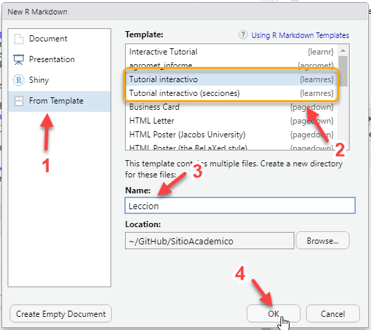

# learnres: paquete de plantillas en español para {learnr}


Conjunto de plantillas en español para generar tutoriales interactivos con el paquete [learnr](https://rstudio.github.io/learnr/).  

Este paquete contiene dos plantillas para generar tutoriales con `learnr`:

- La misma plantilla que viene por defecto en `learnr`, pero traducida al español.

- Una segunda plantilla con una sugerencia de estructura y elementos que contribuyen a que el material contemple algunas herramientas pedagógicas y pueda ser compartido, reutilizado, citado y encontrado.

También tiene una hoja `CSS` con los estilos explicados para que la puedas editar y generar los propios.

### Instalación

Para instalar la versión de desarrollo desde GitHub, usá:

``` r
# install.packages("remotes")
remotes::install_github("yabellini/learnres")
```

### Ejemplos de uso

Para generar un nuevo tutorial con las plantillas en español, luego de instalar el paquete y dentro de RStudio seleccionamos **File** -> **New File** -> **RMarkdown** -> **From Template** -> 




### Licencia

* Licencia para el código: [Licencia hipocrática](https://firstdonoharm.dev/). Versión corta: puedes usar el código libremente siempre que no estés violando los tratados básicos de derechos humanos.

* Licencia para el material: las plantillas de este paquete se distribuyen bajo la misma licencia que todos los materiales de MetaDocencia +  la licencia indicada en algunos de los materiales utilzados como fuente: [Creative Commons Atribución – No Comercial 4.0 (CC-BY-NC-4.0)](https://github.com/yabellini/learnres/edit/main/LICENSE.md).


### Como contribuir

Para contribuir con este paquete podés leer la siguiente [guía para contribuir](https://github.com/yabellini/learnres/blob/main/CONTRIBUTING.md). Te pedimos también que revises nuestro [Código de Conducta.](https://github.com/yabellini/learnres/blob/main/CONDUCT.md)
