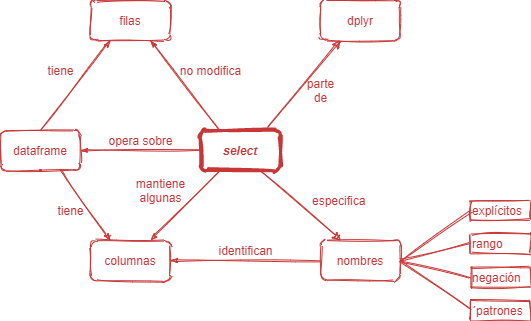

```{r setup, include=FALSE}
library(learnr)
knitr::opts_chunk$set(echo = FALSE,
                 exercise.warn_invisible = FALSE)
```

## Presentación y Bienvenida 

```{r, echo=FALSE, out.width="100%", fig.align = "center"}

```
> Foto de Markus Winkler en [Unsplash](https://unsplash.com/photos/92HqQ0ZvKDA?utm_source=unsplash&utm_medium=referral&utm_content=creditShareLink)


### Estructura propuesta

En esta plantilla proponemos una sección de __Presentación y Bienvenida__ del curso que contiene herramientas pedagógicas pensadas para contribuir a la apertura, reuso y aprovechamiento de tus materiales de enseñanza.  Sugerimos que esta sección contenga:

* Objetivos de aprendizaje.
* Personas Tipo
* Licencia
* _Opcionalmente: un mapa conceptual de los contenidos del tutorial_

### Descripción del curso con Objetivos de aprendizaje.

La descripción del curso enumera los _contenidos_, el _orden_ y opcionalmente el _tiempo involucrado_ en cubrir cada tema.  También suele mencionar las herramientas que se utilizarán para enseñar y los elementos que las y los estudiantes necesitan tener disponibles.

Un [Objetivo de aprendizaje](https://teachtogether.tech/es/index.html#s:process-objectives) describe claramente qué está intentando lograr la lección y cómo la/el estudiante demostrará lo que aprendió una vez que haya completado la lección. 

#### Ejemplo de descripción y objetivos de aprendizaje

<div class="note">

Este tutorial te mostrará cómo crear y mejorar **gráficos de barras** con el paquete `ggplot2`. Aprenderás a:

* hacer e interpretar gráficos de barras
* personalizar gráficos de barras con **estéticas** (_aesthetics_, en inglés)
* usar **facetas** (_facets_, en inglés) para crear subgráficos. 

</div>


### Personas tipo o ¿Quién sos vos?
```{r, echo=FALSE, out.width="100%", fig.align = "center"}
knitr::include_graphics("images/gentecompu.jpg")  
```
> [Foto de Brooke Cagle en Unsplash](https://unsplash.com/photos/C-v1p2DTakA)

Las personas tipo describen el público para el que fue pensado el curso. Como se explica en el libro [Teaching Teach Together](https://teachtogether.tech/es/index.html#s:process-personas) debe contemplar los siguientes aspectos:

* __los antecedentes generales__ del/la estudiante,
* __los conocimientos y/o experiencia previa relevante__,
* lo que estos __estudiantes creen que quieren aprender__ (versus lo que el/la docente cree que deberían aprender), y
* cualquier __consideración especial__, como las necesidades de accesibilidad.

#### Ejemplo de personas tipo 

Cuando generamos esta plantilla pensamos en las siguientes personas tipo:

<div class="note">

__Rene:__ es docente y ha tenido que llevar su clase de introducción a R a formato virtual, esto le hace muy difícil poder ayudar a sus alumnos con la configuración de sus máquinas personales con todo el software necesario para llevar adelante la clase. Ya tiene ejercicios generados en formato rmarkdown. Con la idea de que puedan empezar a trabajar enseguida con R sin sufrir con la instalación en un inicio le parece buena idea generar tutoriales interactivos porque escuchó que se pueden publicar como una aplicación shiny.

</div>


Si quieres más ejemplos estas personas de [MetaDocencia](https://www.metadocencia.org/post/personas-tipo/), [RStudio Education](https://education.rstudio.com/blog/2020/10/learner-personas/) y [mis cursos](https://github.com/yabellini/learner_personas) pueden servirte de inspiración.


### Licencia

Los materiales que cuentan con una licencia permiten ser utilizados correctamente.  Si la licencia no figura explicitamente, por defecto el contenido es cerrado. 

Sugerimos seleccionar una licencia abierta tanto para el material (texto, imágenes, videos) como para el software. 

#### Material

Las licencias [Creative Commons](http://www.creativecommons.org.ar/licencias.html) proveen diversos tipos  dependiendo de lo que deseamos que pueda hacer quien use nuestros materiales. Este [selector de licencias](https://creativecommons.org/choose/?lang=es_AR) puede ayudarnos a elegir la licencia que mejor se adapta a nuestras necesidades. 

#### Software

Para el software, existen múltiples opciones. Les presentamos tres opciones:

* La [licencia MIT](https://opensource.org/licenses/MIT), que permite que los usuarios le den cualquier uso que quieran al código.

* Usar la [Licencia Pública General de GNU (GPL)](https://www.gnu.org/licenses/licenses.es.html#GPL), que también permite a los usuarios hacer cualquier uso que quieran exigiendo que compartan su propio código bajo esta licencia.

* La [licencia hipocrática](https://firstdonoharm.dev/version/2/1/license.html), que permite usar el código libremente siempre que el uso no viole los tratados básicos de derechos humanos.  

Tengamos en cuenta que si utilizamos código de otros autores pueden existir restricciones con respecto a que licencia podemos asignar a nuestro propio código.

#### Ejemplo de licencia:

<div class="note">

```{r, echo=FALSE, fig.align = "left"}
knitr::include_graphics("images/CC_BY-SA_4.0.png")  
```
Este curso se comparte bajo la licencia [Creative Commons Attribution-ShareAlike 4.0 International License](https://creativecommons.org/licenses/by-sa/4.0/deed.es_ES) y fue realizado por [Yanina Bellini Saibene](https://yabellini.netlify.app/)

</div>

### _Opcional: mapa conceptual_

Los [mapas conceptuales](https://teachtogether.tech/es/index.html#s:memory-concept-maps) representan un modelo mental del tema que se quiere enseñar. Ayudan a las y los docentes a describir lo que quieren enseñar, brindan a otras y otros instructores una descripción general rápida de una lección y permiten a las y los estudiantes verificar que han construido el modelo mental correcto.

#### Ejemplo de mapa conceptual

Este mapa conceptual presenta un mapa mental del verbo `select` de tidyverse.

<div class="note">

```{r, echo=FALSE, , out.width="80%", fig.align = "center"}
  

```
Fuente: [Mapas Conceptuales RStudio](https://github.com/gvwilson/concept-maps#select) - Autores: Monica Alonso, Greg Wilson 
</div>


En este [post](https://learning-learnr.netlify.app/post/concept_maps/) se detalla como agregar mapas conceptuales a nuestros tutoriales y en [este repo](https://github.com/rstudio/concept-maps/tree/master/es) pueden encontrar un listado de mapas conceptuales con licencia CC-BY.

## Tema 1

### Ejercicios

*Aquí hay un ejercicio simple con un fragmento de código vacío proporcionado para ingresar la respuesta.*

Escriba el código R requerido para sumar dos más dos y luego presione el botón _Run Code_:

```{r dos-mas-dos, exercise=TRUE}

```

### Ejercicio con código para completar

*Aquí hay un ejercicio con un código preescrito en el ejercicio, y el parámetro `exercise.lines = 5` para proporcionar un poco más de espacio inicial para trabajar.*

Ahora escribe una función que sume dos números y luego llámela para sumar 3 + 5:

```{r funcion-sumar, exercise=TRUE, exercise.lines = 5}
sumar <- function(___,___) {
  ______
}

sumar(___,___)
```

```{r funcion-sumar-hint}
sumar <- function(___,___) {
  # Aqui debe ir el calculo sumando los dos parámetros 
  # que debe tener la función para recibir los dos números a sumar
}

sumar(___,___)
```

```{r funcion-sumar-solution}
sumar <- function(numero1,numero2) {
  numero1+numero2
}

sumar(5,3)
```


## Tema 2

### Preguntas

*Se puede incluir cualquier número de preguntas de opción única o múltiple. UPara esto se usa la función `question` para definir una pregunta y la función` quiz` para agrupar varias preguntas.*

```{r quiz_1}

quiz(
  question("¿Qué paquete del listado nos permite realizar gráficos?", 
  correct = "Buen trabajo!, ggplot2 es el paquete que nos permite realizar gráficos.", 
  allow_retry = TRUE,
    answer("ggplot", message = "Cerca, pero no...intentalo de nuevo!"),
    answer("gplot2", message = "Nop...intentalo de nuevo!"),
    answer("plot2", message = "Incorrecto. Intenta de nuevo!."),
    answer("ggplot2", correct = TRUE),
    # Si no cambiamos estos textos en los botones, se mostrarán en Inglés  
    submit_button = "Enviar respuesta",
    try_again_button = "Intentar de nuevo"),
  # Si no ponemos un caption aparecerá la palabra Quiz en inglés.
   caption = "Visualización"
)

```

Otra serie de preguntas agrupadas y con más de una respuesta correcta:

```{r quiz}
quiz(
  question("¿Qué paquete contiene funciones para instalar otros paquetes R?",
    answer("base"),
    answer("tools"),
    answer("utils", correct = TRUE),
    answer("codetools"),
# Si no cambiamos estos textos en los botones, se mostrarán en Inglés
        submit_button = "Enviar respuesta",
    try_again_button = "Intentar de nuevo"),
  question("¿Cuál de los paquetes R enumerados a continuación se usa para crear gráficos?",
    answer("lattice", correct = TRUE),
    answer("tools"),
    answer("stats"),
    answer("grid", correct = TRUE),
# Si no cambiamos estos textos en los botones, se mostrarán en Inglés
    submit_button = "Enviar respuesta",
    try_again_button = "Intentar de nuevo")
)
```
